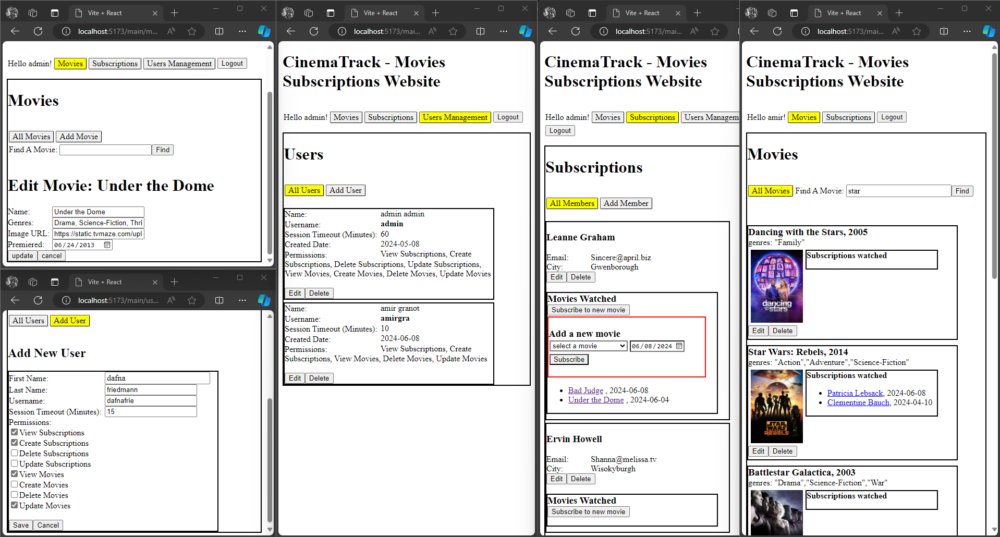
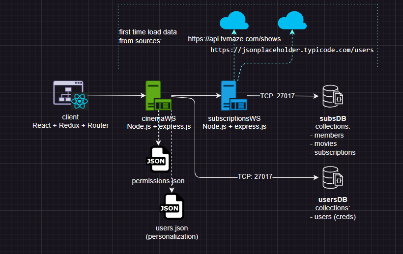

# CinemaTrack - Movies Subscriptions Management System

Built with 2 backend servers (server to server communication), and client built with React, Redux with async loading and updating (Thunk functions).
Implemented authentication and authorization with roles and permissions lists, so capabilities are restricted by types of permissions given.

- [React Client](client/README.md)
- Node Front Server - [cinemaWS](cinemaWS/README.md)
  Provides:
    -   Authentication and Authorization (JWT, session timeout, permissions and resource access limitations)
    -   Users management
    -   Proxy to backend server
- Node Back Server - [subscriptionsWS](subscriptionsWS/README.md)
  Provides:
    -  subscriptions management (member watched movie STAR at TIME)
    -  movies management
    -  members management

