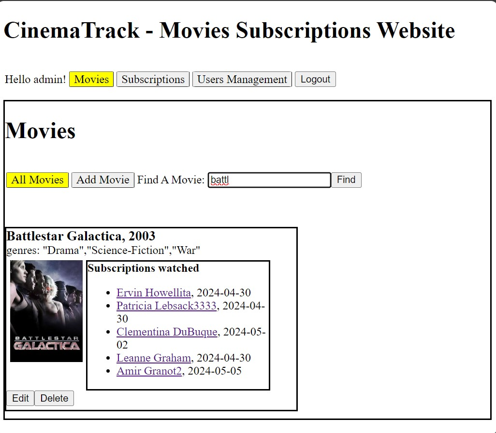

# CinemaTrack - React Client for Movies Subscriptions Management System

## How To Setup

1. Clone the repo
   - `git clone ...`
2. Start backend servers
   - [subscriptionsWS](../subscriptionsWS/ReadMe.md)
   - [cinemaWS](../cinemaWS/ReadMe.md)
3. Install required packages
   - `npm install`
4. Run the client
   - `npm run dev`
5. Login using the `admin` username with its password that is provided when running [cinemaWS](../cinemaWS/ReadMe.md) for the first time.
